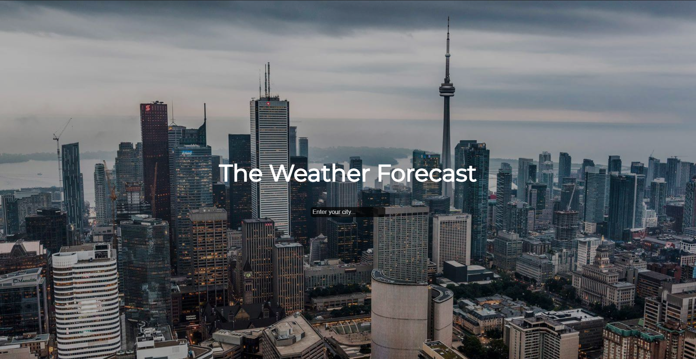
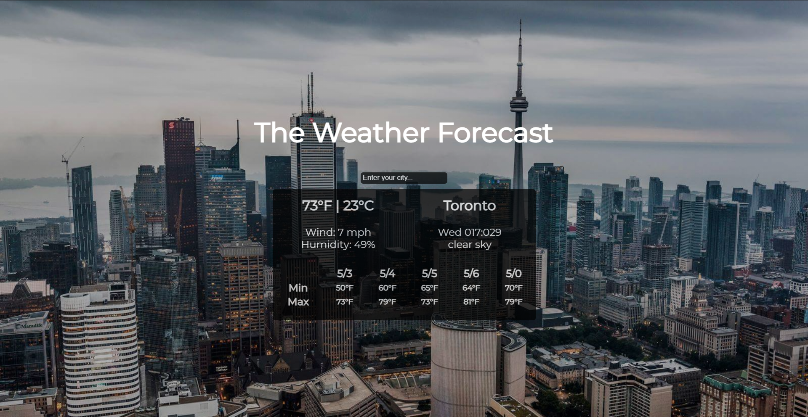

# React Weather App

This project was bootstrapped with [Create React App](https://github.com/facebook/create-react-app).

## Description
- An introduction into React and front-end development
- A SPA that returns the current and 5 day forecast based on the given city.

## API Used
- Open Weather Map https://openweathermap.org/api - Current Weather Data and One Call API

## To Run
- In the project directory, you can run:
- ### `yarn start`

## Examples:

